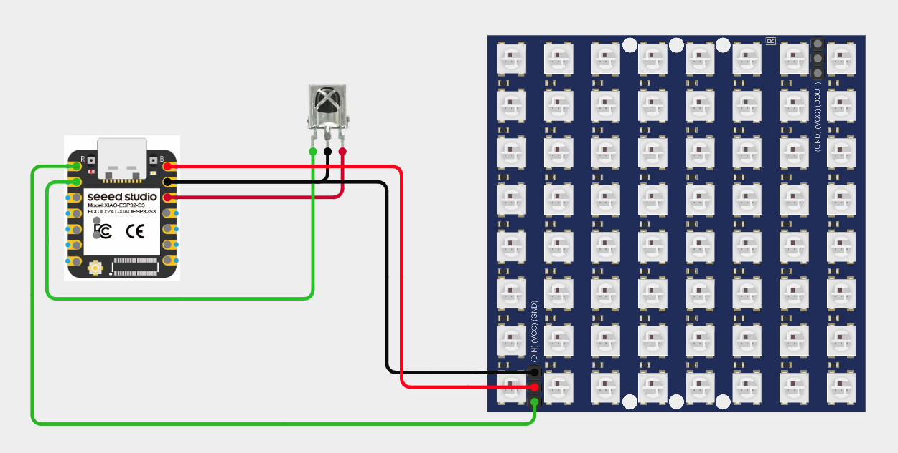

# XIAO-005-Multi-Animation-Neo-pixel-Controller 🎨
Bring colors to life with the Multi Animation NeoPixel Controller! 🌈 Using the XIAO ESP32S3 and a WS2812 RGB LED matrix, this project lets you switch between stunning LED animations using an IR remote. From flowing patterns to dynamic effects — all controlled wirelessly and in real time!

---

## 🛠️ Components Used

1. [XIAO ESP32S3](https://robocraze.com/products/seeed-studio-xiao-esp32-s3-development-board-supports-wi-fi-bluetooth-5-0?_pos=1&_psq=XIAO+ESP32+S3&_ss=e&_v=1.0)
2. [WS2812 8x8 RGB LED Matrix](https://robocraze.com/products/ws2812-64-bit-rgb-led-matrix?_pos=1&_sid=40e72d7a9&_ss=r)
3. [VS1838B IR Receiver](https://robocraze.com/products/ir-receiving-head-vs1838b-remote-control-receiver?_pos=1&_psq=VS1838B+IR+Receiver&_ss=e&_v=1.0)
4. [IR Remote](https://robocraze.com/products/ir-remote?_pos=2&_psq=IR+REMOTE&_ss=e&_v=1.0)
5. [Breadboard](https://robocraze.com/products/breadboard?_pos=3&_psq=BREADBOARD&_ss=e&_v=1.0)
6. [Jumper Wires](https://robocraze.com/products/f2m-jumper-wires-20cm-40pcs?_pos=1&_psq=JUMPER+WIRES&_ss=e&_v=1.0)

---

## 🎥 Project Demo

📱 [Instagram Reel](https://www.instagram.com/reel/DQotutoE3jX/?igsh=MXVnY29vdnB6aHVzbA==)

---

## Circuit Diagram

---
